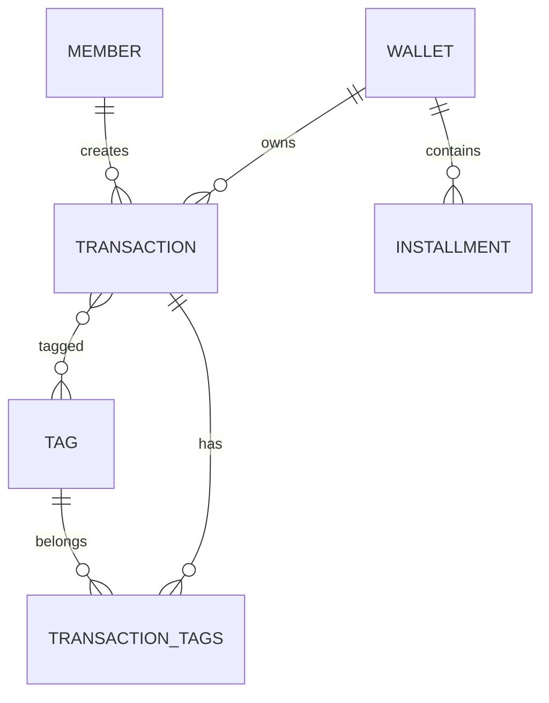

# Database Design

---

# 1. Overview

FinTrack uses **SQLite** through **Room ORM**.

The database is designed based on **Clean Architecture** principles and optimized for **offline-first mobile applications**.

## Goals

- High Performance
- Offline First
- Easy Migration
- Future Cloud Synchronization
- Extensibility
- Scalable Architecture
- Data Integrity

---

# 2. Database Engine

| Item | Value |
|------|-------|
| Database | SQLite |
| ORM | Room |
| Language | Kotlin |
| Pattern | Repository Pattern |
| Migration | Room Migration |
| Async | Coroutines |
| Reactive | Flow / StateFlow |

---

# 3. Naming Convention

## Tables

- wallet
- transactions
- members
- tags
- installment
- transaction_tags

## Primary Key

```text
id
```

## Foreign Keys

```text
walletId
memberId
transactionId
tagId
toWalletId
```

## Audit Fields

```text
createdAt
updatedAt
isDeleted
version
```

---

# 4. Database Entities

---

## Wallet

Represents a financial account.

| Field | Type |
|------|------|
| id | Long |
| name | String |
| balance | Double |
| color | String |
| createdAt | Long |
| updatedAt | Long |
| isDeleted | Boolean |
| version | Int |

---

## Transaction

Represents every financial operation.

Supports:

- Income
- Expense
- Transfer

| Field | Type |
|------|------|
| id | Long |
| amount | Double |
| type | TransactionType |
| categoryName | String |
| walletId | Long |
| toWalletId | Long? |
| memberId | Long |
| date | Long |
| note | String |
| createdAt | Long |
| updatedAt | Long |
| isDeleted | Boolean |
| version | Int |

---

## Member

Represents a family member.

| Field | Type |
|------|------|
| id | Long |
| name | String |
| relation | String |
| icon | String |
| color | String |
| createdAt | Long |
| updatedAt | Long |
| isDeleted | Boolean |
| version | Int |

---

## Tag

Represents transaction labels.

| Field | Type |
|------|------|
| id | Long |
| name | String |
| color | Long |
| workspaceId | Long |
| allowedType | TransactionType |
| createdAt | Long |
| updatedAt | Long |
| isDeleted | Boolean |
| version | Int |

---

## Installment

Represents financial commitments.

| Field | Type |
|------|------|
| id | Long |
| title | String |
| totalAmount | Double |
| paidAmount | Double |
| dueDate | Long |
| walletId | Long |
| note | String |
| isPaid | Boolean |
| createdAt | Long |
| updatedAt | Long |
| isDeleted | Boolean |
| version | Int |

---

## TransactionTagCrossRef

Represents many-to-many relationship between transactions and tags.

| Field | Type |
|------|------|
| transactionId | Long |
| tagId | Long |

---

# 5. Relationships

```text
Wallet
 1
 │
 └────────────── N Transaction

Member
 1
 │
 └────────────── N Transaction

Transaction
 N
 │
 └────────────── N Tag
```

---

# 6. Entity Relationship Diagram



---

# 7. Indexes

| Table | Index |
|--------|-------|
| transactions | walletId |
| transactions | memberId |
| transactions | toWalletId |
| transaction_tags | transactionId |
| transaction_tags | tagId |

## Purpose

- Faster Search
- Faster Filtering
- Faster JOIN
- Better Report Performance

---

# 8. Constraints

## Primary Keys

- Auto Increment

## Foreign Keys

Transaction.walletId → Wallet.id

Transaction.memberId → Member.id

Transaction.toWalletId → Wallet.id

TransactionTag.transactionId → Transaction.id

TransactionTag.tagId → Tag.id

## Delete Rules

```text
CASCADE

SET NULL
```

## Nullable Fields

```text
toWalletId

workspaceId

note
```

---

# 9. Migration History

| Version | Changes |
|----------|----------|
| 1.0 | Wallet |
| 1.1 | Transactions |
| 1.2 | Members |
| 1.3 | Reports |
| 1.4 | Tags |
| 1.5 | Installments |

---

# 10. Database Optimization

Current optimizations

- Room ORM
- Kotlin Coroutines
- Flow
- StateFlow
- Foreign Keys
- Indexes
- Lazy Loading
- Repository Pattern
- Offline First
- Single Database Instance
- Hilt Dependency Injection

---

# 11. BaseEntity

Every persistent entity contains the following audit fields.

| Field | Purpose |
|------|---------|
| createdAt | Creation Time |
| updatedAt | Last Update |
| isDeleted | Soft Delete |
| version | Version Control |

These fields prepare the database for future synchronization and cloud support.

---

# 12. Future Database Design

Future entities planned for upcoming versions.

```text
Workspace

Organization

Cloud Sync

Device

Backup

Budget

Goal

Currency

Notification

Attachment

Receipt OCR

Exchange Rate

AI Prompt History

Embedding Cache

Vector Store

Recommendation Cache

Prediction Result

Subscription

Premium Features

User Profile
```

---

# 13. Database Principles

- Offline First
- Single Source of Truth
- Clean Architecture
- Repository Pattern
- Immutable Domain Models
- Soft Delete Support
- Migration Safe
- Scalable Schema
- AI Ready
- Cloud Ready
- Multi Workspace Ready
- Future SaaS Ready