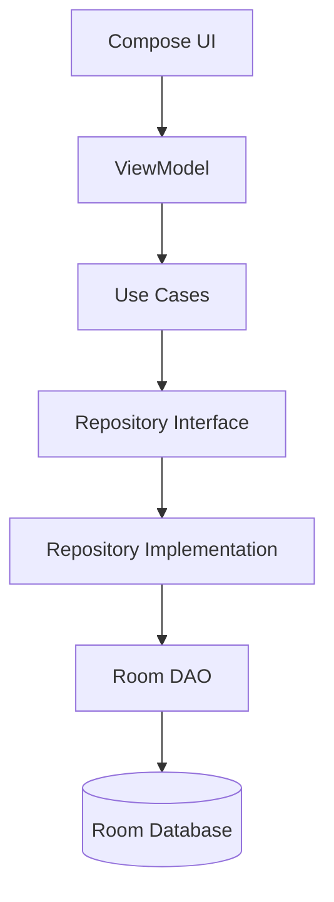
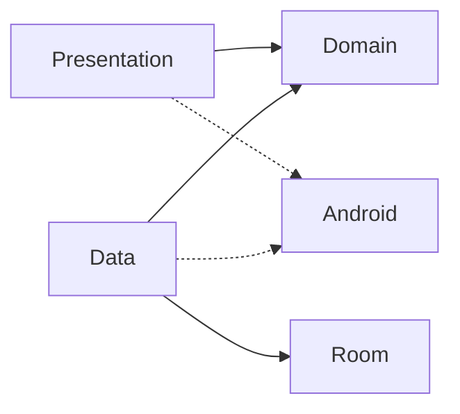
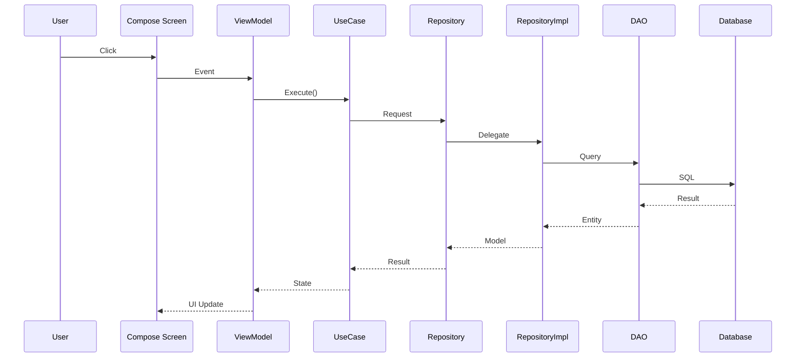

# Clean Architecture

---

# مقدمه

FinTrack بر اساس معماری Clean Architecture توسعه یافته است.

هدف این معماری، جداسازی مسئولیت‌ها، افزایش تست‌پذیری، توسعه‌پذیری و کاهش وابستگی بین بخش‌های مختلف سیستم است.

در این ساختار، قوانین کسب‌وکار مستقل از رابط کاربری، دیتابیس و فریم‌ورک‌های اندروید باقی می‌مانند.

---

# اهداف معماری

- استقلال از Android Framework
- استقلال از Database
- استقلال از UI
- قابلیت تست بالا
- توسعه آسان
- نگهداری ساده
- کاهش Coupling
- افزایش Cohesion

---

# لایه‌های معماری

```
Presentation
      │
      ▼
Domain
      │
      ▼
Data
      │
      ▼
Room / DataStore
```

---

# نمودار کلی معماری



---

# وابستگی‌ها



تنها وابستگی مجاز بین لایه‌ها مطابق شکل بالا است.

Domain هیچ وابستگی مستقیمی به Android یا Room ندارد.

---

# لایه Presentation

مسئول نمایش اطلاعات و دریافت تعاملات کاربر است.

اجزای اصلی

- Screen
- ViewModel
- State
- Event
- Navigation
- Components

وظایف

- نمایش UI
- مدیریت State
- ارسال Event
- فراخوانی UseCase

این لایه نباید منطق تجاری داشته باشد.

---

# لایه Domain

هسته اصلی پروژه.

اجزای اصلی

- Entity
- Model
- Repository Interface
- UseCase
- Calculator
- Business Rules

وظایف

- قوانین کسب‌وکار
- اعتبارسنجی
- محاسبات
- منطق سیستم

Domain مستقل از Android است.

---

# لایه Data

پیاده‌سازی واقعی دسترسی به داده‌ها.

اجزای اصلی

- RepositoryImpl
- DAO
- Entity
- Mapper
- Local Data Source
- DataStore

وظایف

- ارتباط با دیتابیس
- تبدیل Entity به Model
- خواندن و ذخیره اطلاعات

---

# جریان اجرای یک درخواست



---

# اصل Dependency Rule

تمام وابستگی‌ها باید به سمت داخل معماری باشند.

```
Presentation
      │
      ▼
Domain
```

نه برعکس.

Domain نباید Presentation را بشناسد.

---

# Repository Pattern

Repository تنها Interface را در Domain تعریف می‌کند.

پیاده‌سازی در Data انجام می‌شود.

```
Domain

WalletRepository

↓

Data

WalletRepositoryImpl
```

---

# UseCase Pattern

هر عملیات کسب‌وکار در یک UseCase مستقل پیاده‌سازی می‌شود.

نمونه‌ها

- InsertTransactionUseCase
- DeleteWalletUseCase
- UpdateMemberUseCase
- GetDashboardSummaryUseCase

هر UseCase تنها یک مسئولیت دارد.

---

# مزایای معماری

- قابلیت تست بالا
- توسعه آسان
- تعویض ساده دیتابیس
- تعویض ساده UI
- قابلیت توسعه به Cloud
- قابلیت توسعه به AI
- نگهداری آسان

---

# توسعه در آینده

ساختار فعلی امکان افزودن موارد زیر را بدون تغییر اساسی فراهم می‌کند.

- Cloud Sync
- Remote API
- Offline First
- AI Module
- Multi Workspace
- Plugin System

---

# نتیجه‌گیری

معماری Clean Architecture ستون اصلی FinTrack است و تضمین می‌کند که با رشد پروژه، منطق کسب‌وکار مستقل باقی بماند، توسعه ویژگی‌های جدید ساده باشد و نگهداری بلندمدت سیستم با کمترین هزینه انجام شود.