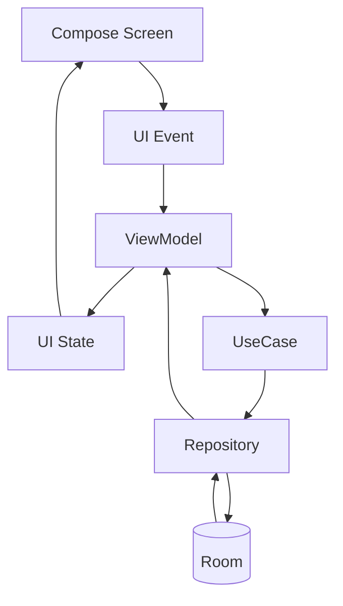
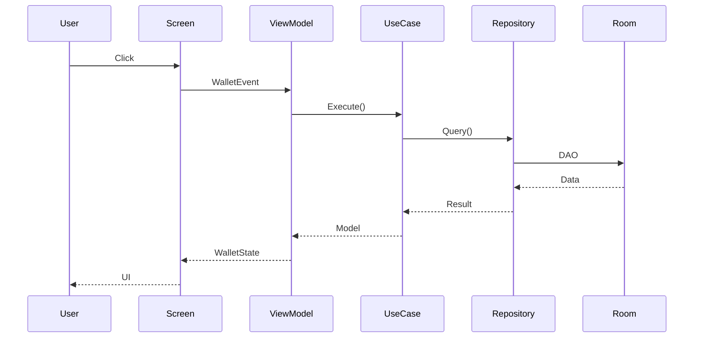

# MVVM Architecture

---

# مقدمه

FinTrack از الگوی **MVVM (Model-View-ViewModel)** برای مدیریت رابط کاربری استفاده می‌کند.

هدف MVVM جداسازی کامل رابط کاربری از منطق برنامه است تا صفحات قابل تست، توسعه‌پذیر و قابل نگهداری باشند.

در این معماری، Compose فقط وضعیت (State) را نمایش می‌دهد و تمام منطق در ViewModel قرار می‌گیرد.

---

# اهداف MVVM

- جداسازی UI از منطق
- مدیریت State
- تست‌پذیری
- قابلیت نگهداری
- کاهش وابستگی
- پشتیبانی کامل از Jetpack Compose

---

# ساختار کلی

```text
UI (Compose)
      │
      ▼
ViewModel
      │
      ▼
UseCase
      │
      ▼
Repository
      │
      ▼
Room
```

---

# نمودار MVVM



---

# اجزای MVVM

## View

وظایف

- نمایش اطلاعات
- دریافت تعامل کاربر
- ارسال Event
- نمایش State

نباید شامل منطق تجاری باشد.

---

## ViewModel

وظایف

- دریافت Event
- فراخوانی UseCase
- مدیریت State
- مدیریت Loading
- مدیریت Error

ViewModel هیچ اطلاعی از Compose ندارد.

---

## Model

در FinTrack منظور از Model موارد زیر است.

- Domain Model
- Repository
- UseCase
- Entity

---

# ساختار هر Feature

```text
wallet/

├── WalletScreen.kt
├── WalletRoute.kt
├── WalletViewModel.kt
├── WalletState.kt
├── WalletEvent.kt
└── components/
```

همین الگو برای تمام Featureها رعایت می‌شود.

---

# جریان داده



---

# State

تمام وضعیت صفحه در یک کلاس State نگهداری می‌شود.

نمونه

```kotlin
WalletState

- wallets
- isLoading
- error
```

State باید Immutable باشد.

---

# Event

تمام تعاملات کاربر به صورت Event تعریف می‌شوند.

نمونه

```text
Load

AddWallet

DeleteWallet

Refresh

Search

Save
```

تمام Eventها توسط ViewModel پردازش می‌شوند.

---

# StateFlow

برای مدیریت وضعیت صفحات از StateFlow استفاده می‌شود.

مزایا

- Reactive
- Lifecycle Aware
- مناسب Compose
- Thread Safe

---

# جمع‌آوری State

در Compose

```text
collectAsStateWithLifecycle()
```

برای دریافت State استفاده می‌شود.

---

# اصل Single Source of Truth

فقط ViewModel اجازه تغییر State را دارد.

```
User

↓

ViewModel

↓

StateFlow

↓

Compose
```

هیچ Screen نباید مستقیماً State را تغییر دهد.

---

# مدیریت خطا

ViewModel مسئول مدیریت خطا است.

نمونه‌ها

- Database Error
- Validation Error
- Unknown Error

خطاها به صورت State به UI ارسال می‌شوند.

---

# مدیریت Loading

تمام عملیات طولانی باید دارای وضعیت Loading باشند.

```
Loading

↓

Success

↓

Error
```

---

# Dependency Injection

تمام ViewModelها توسط Hilt ساخته می‌شوند.

نمونه

```text
@HiltViewModel

WalletViewModel
```

---

# بهترین شیوه‌ها

- هر Screen یک ViewModel
- هر ViewModel یک State
- Eventهای مستقل
- عدم نگهداری Context
- عدم استفاده مستقیم از DAO
- استفاده فقط از UseCase
- عدم انجام Business Logic در UI

---

# مزایای MVVM در FinTrack

- توسعه آسان Featureهای جدید
- تست مستقل ViewModel
- کاهش پیچیدگی صفحات Compose
- مدیریت ساده State
- هماهنگی کامل با Clean Architecture
- پشتیبانی مناسب از Hilt و StateFlow

---

# نتیجه‌گیری

MVVM در FinTrack نقش لایه ارتباطی بین رابط کاربری و منطق کسب‌وکار را بر عهده دارد. این ساختار باعث می‌شود صفحات تنها مسئول نمایش داده‌ها باشند و تمام منطق، مدیریت وضعیت و تعامل با Domain در ViewModel انجام شود.