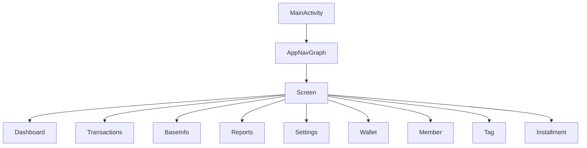
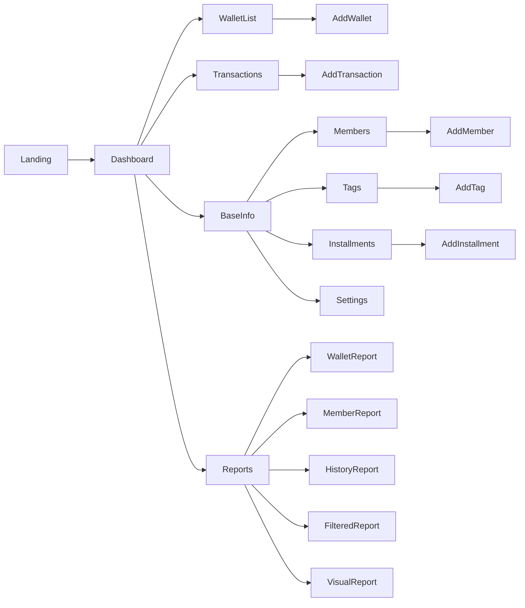

# Navigation Architecture

---

# مقدمه

FinTrack از **Navigation Compose** به همراه **Type-safe Navigation** مبتنی بر Kotlin Serialization استفاده می‌کند.

تمام مسیرهای برنامه در یک قرارداد واحد به نام `Screen` تعریف شده‌اند و هیچ Route رشته‌ای (String Route) در پروژه استفاده نمی‌شود.

این ساختار احتمال خطا را کاهش داده و توسعه و نگهداری مسیرها را ساده‌تر می‌کند.

---

# اهداف

- Type-safe Navigation
- حذف Route String
- مدیریت متمرکز مسیرها
- توسعه‌پذیری
- خوانایی بیشتر
- جلوگیری از خطاهای Runtime

---

# ساختار ناوبری

```text
MainActivity
      │
      ▼
AppNavGraph
      │
      ▼
Screen Contract
      │
      ▼
Composable Screens
```

---

# نمودار کلی



---

# قرارداد Screen

تمام صفحات پروژه در یک کلاس Sealed نگهداری می‌شوند.

نمونه

```text
Screen

Dashboard

Transactions

Reports

Settings

WalletList

Members

Tags

Installments

AddEditWallet

AddEditTransaction

AddEditMember

AddEditTag

AddEditInstallment
```

---

# مزایای Type-safe Navigation

- بدون Route String
- بررسی خطا در زمان Compile
- ارسال پارامترهای Type-safe
- Refactor آسان
- خوانایی بیشتر

---

# مسیرهای اصلی

```text
Landing

↓

Dashboard

↓

Bottom Navigation

├── Dashboard
├── Transactions
├── BaseInfo
└── Reports
```

---

# مسیرهای فرعی

```text
Wallet List
    │
    └── Add/Edit Wallet

Member List
    │
    └── Add/Edit Member

Tag List
    │
    └── Add/Edit Tag

Transaction List
    │
    └── Add/Edit Transaction

Installment List
    │
    └── Add/Edit Installment
```

---

# نمودار صفحات



---

# Bottom Navigation

Bottom Navigation تنها در صفحات اصلی نمایش داده می‌شود.

```text
Dashboard

Transactions

BaseInfo

Reports
```

صفحات افزودن و ویرایش Bottom Bar ندارند.

---

# Navigation Flow

```mermaid
sequenceDiagram

User->>Compose Screen: Click

Compose->>NavController: navigate()

NavController->>AppNavGraph

AppNavGraph->>Destination

Destination-->>Compose
```

---

# ارسال پارامتر

صفحات ویرایش با پارامتر شناسه باز می‌شوند.

نمونه‌ها

```text
AddEditWallet(walletId)

AddEditMember(memberId)

AddEditTransaction(transactionId)

AddEditTag(tagId)

AddEditInstallment(installmentId)
```

اگر مقدار شناسه Null باشد، صفحه در حالت ایجاد رکورد جدید باز می‌شود.

---

# Landing Flow

```mermaid
flowchart LR

Application

↓

Landing

↓

Dashboard
```

صفحه Landing فقط یک بار در شروع برنامه نمایش داده می‌شود.

---

# اصل Single Navigation Graph

کل برنامه فقط یک Navigation Graph اصلی دارد.

تمام Featureها مسیرهای خود را در همین Graph ثبت می‌کنند.

---

# بهترین شیوه‌ها

- استفاده از Type-safe Navigation
- عدم استفاده از Route String
- تعریف تمام مسیرها در Screen
- استفاده از NavController فقط در لایه Presentation
- عدم استفاده از Navigation در ViewModel
- ارسال فقط شناسه‌ها بین صفحات
- عدم ارسال Objectهای بزرگ از طریق Navigation

---

# توسعه آینده

ساختار فعلی امکان افزودن موارد زیر را فراهم می‌کند.

- Deep Links
- Dynamic Feature Modules
- Nested Graph
- Authentication Flow
- Cloud Sync Flow
- AI Assistant Navigation
- Widget Navigation

---

# نتیجه‌گیری

معماری Navigation در FinTrack بر پایه Navigation Compose و Type-safe Routing طراحی شده است. این ساختار باعث کاهش خطاهای Runtime، افزایش خوانایی کد و توسعه آسان مسیرهای جدید در آینده می‌شود.